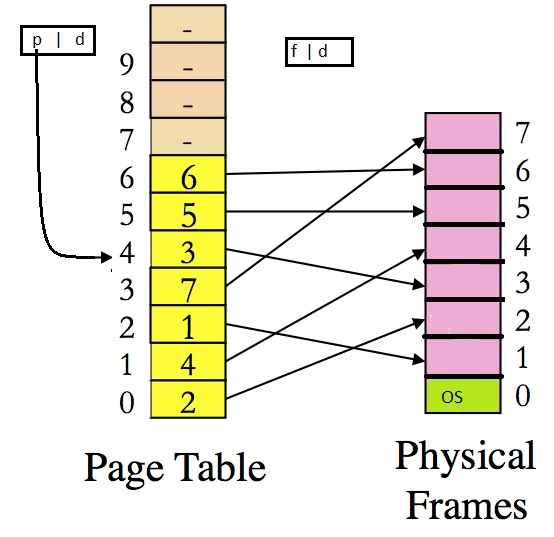

# CS 3733 Operating Systems

## Assignment 3

## Overview

This assignment includes two parts, with a total of 100 points. There is an additional third part, worth 20 points, that is extra credit. This assignment is to be completed on your own.

This assignment is on memory management, where we design a simulator that implements the OS address translation mechanisms. Although an OS can usually support many processes, we only need to design a simulator that handles one process.

The reference computing system for this assignment has the following properties:

- 1K physical memory
- 4K virtual memory
- 128 bytes per page and frame

Before designing the simulator, you should understand the answers to the following questions:

1. What is the maximum number of pages a process can access? (Answer: 32 pages)
2. What is the total number of frames? (Answer: 8 frames)
3. How many entries does the pagetable contain? (Answer: 32 entries)

You will practice page table management and physical memory allocation by emulating what happens inside the OS kernel.

## Part 1: Address Translation and I/O (30 points)

Assume a process has the following page table:



Create a directory called `assign3` for this assignment. Under this directory, write a main program called `part1.c` that takes only two parameters:

- `infile`: the name of a sequence file containing logical memory accesses
- `outfile`: the name of the file to which output is written

Each logical address in `infile` is saved as 8 bytes (`unsigned long`) in binary format. Your program should read each logical address and then translate it into a corresponding physical address based on the page table given above. The physical addresses must be printed to `outfile`, in the same binary format that the sequence file is in.

The logical memory address is saved in binary format. To verify that you can read the correct sequence of memory accesses, you can first print out the address that you analyzed. You can test your program with the given simple `part1testsequence`, where:

- the first address should be `0x0000000000000044`
- the second one should be `0x0000000000000224`

For each logical address in the sequence file, use the page table given above to perform address translation and generate a corresponding physical address that will be written to the file specified as the second command-line parameter to `part1.c`. The `outfile` must have the same format as the given `part1testsequence` file. Each physical address must be written in binary as an 8-byte (`unsigned long`) value.

Once you test your program with `part1testsequence` and are sure the program performs correct address translation, use `part1sequence` as input to generate translated physical addresses and write them to a file called `part1-output`. Then compute the `md5sum` checksum on `part1-output`. Type the checksum for `part1-output` into `REPORT.txt`.

Note: to simplify Part 1, you can hardcode the mapping from page to frame into an array before performing any address translation.

## Part 2: Virtual Memory (70 points)

In this part, you will design a page table and perform physical memory management. You will create two new source files for this part: `phypages.c` and `pagetable.c`, and a new main program named `part2.c`, plus any necessary header files.

- `phypages.c` is used to manage the physical pages.
- `pagetable.c` will manage the page table for the process.

As implicitly assumed earlier, the first physical frame is reserved for the OS; the other frames are initially free. You will initially use the following frame allocation scheme:

1. Allocate the physical page in order of frame number, starting from 1, 2, 3, ...
2. When there are no free physical frames, use the LRU policy for page replacement. That means the page that is least recently used (accessed) will be allocated to the new request.

Once a frame is selected to be freed, you need to do two things:

1. Invalidate the old entry of the page table so that two virtual pages do not point to the same physical frame.
2. Initialize a new page table entry (PTE) to point to the new frame. You may also want to set up a reverse mapping on the frame to the PTE for quick PTE modifications in the future.

If a page is accessed, you must update its placement in the frame list so that it will not be evicted soon (based on the LRU policy).

You should be able to use the same function in Part 1 to map virtual addresses into physical addresses. Use this function for translating `part2sequence` into the output for `part2-output`.

Similar to Part 1, type the `md5sum` of `part2-output` into `REPORT.txt` along with the number of page faults encountered when translating Part 2 logical addresses into physical addresses.

## Part 3: Adaptive Design (20 points, extra credit)

To get the bonus points, list whether you implemented Part 3 in your `REPORT.txt` file. Also briefly explain how implementation of this part differs from the previous two parts and why you think your implementation is correct.

You need a main program named `part3.c` that must accept the following parameters:

```bash
./part3 BytesPerPage SizeOfVirtualMemory SizeOfPhysicalMemory SequenceFile OutputFile
```

Where:

- `BytesPerPage` specifies the number of bytes in each physical frame and virtual page
- `SizeOfVirtualMemory` is the size of virtual memory in bytes
- `SizeOfPhysicalMemory` is the size of physical memory in bytes
- `SequenceFile` is the name of the file containing logical addresses to be translated
- `OutputFile` is where translated physical addresses are written

To test your Part 3 functions, you can use the parameters specified in Part 2. Your program should generate the same output file as `output-part2`. In `REPORT.txt`, explain why you think your implementation is correct.

## Submission

1. All source files must be compilable into executables with a single `make` command.
2. All executables must be named as `part1`, `part2`, etc. The names are, by convention, similar to the main program names except without `.c`.
3. The code must be compressed as follows: go into your `cs3733` directory and zip the directory `assign3` into `abc123-assign3.zip`, where `abc123` should be replaced with your `abc123` ID.
4. Submit this single zip file through UTSA BlackBoard.

> Note: not following the submission requirements will result in a severe point deduction.

## Report

Create a `REPORT.txt` file to answer the following questions:

1. List all people that you collaborated with on this assignment. For each person, indicate the level of collaboration (small, medium, large). Also write a few sentences describing what was discussed. Indicate whether you were mainly providing or receiving help.
2. Do you think everything you did is correct?
3. If not, give a brief description of what is working and what progress was made on the part that is not working.
4. Comments (e.g., what were the challenges, how to make this assignment more interesting, etc.)
5. Program output: if you print anything on the screen, then copy/paste it here. Do not copy/paste output files here.

## Grading

To receive full credit for this assignment, you must follow the submission guidelines above and submit it through BB.
